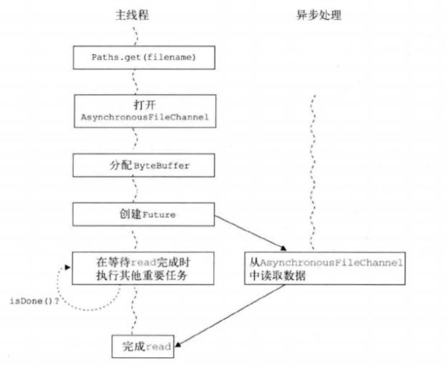
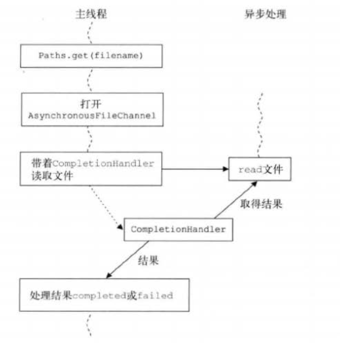

## 简介

jdk7中新增了一些与文件(网络)I/O相关的一些api。这些API被称为NIO.2，或称为AIO(Asynchronous I/O)。AIO最大的一个特性就是异步能力，这种能力对socket与文件I/O都起作用。AIO其实是一种在读写操作结束之前允许进行其他操作的I/O处理。AIO是对JDK1.4中提出的同步非阻塞I/O(NIO)的进一步增强。

关于NIO,之前的一篇文章可以看看：[java中的NIO](./java中的NIO.md)

jdk7主要增加了三个新的异步通道:

- AsynchronousFileChannel: 用于文件异步读写；
- AsynchronousSocketChannel: 客户端异步socket；
- AsynchronousServerSocketChannel: 服务器异步socket。

因为AIO的实施需充分调用OS参与，IO需要操作系统支持、并发也同样需要操作系统的支持，所以性能方面不同操作系统差异会比较明显。

## 前提概念
在具体看AIO之前，我们需要知道一些必要的前提概念。

#### Unix中的I/O模型
Unix定义了五种I/O模型
- 阻塞I/O
- 非阻塞I/O
- I/O复用（select、poll、linux 2.6种改进的epoll）
- 信号驱动IO（SIGIO）
- 异步I/O（POSIX的aio_系列函数）

一个戏谑的例子：
>如果你想吃一份宫保鸡丁盖饭： 
>- 同步阻塞：你到饭馆点餐，然后在那等着，还要一边喊：好了没啊！
>- 同步非阻塞：在饭馆点完餐，就去遛狗了。不过溜一会儿，就回饭馆喊一声：好了没啊！ 
>- 异步阻塞：遛狗的时候，接到饭馆电话，说饭做好了，让您亲自去拿。
>- 异步非阻塞：饭馆打电话说，我们知道您的位置，一会给你送过来，安心遛狗就可以了。 

详情参见文章末尾的他山之石-Unix下五种IO模型。

#### Reactor与Proactor

- 两种IO多路复用方案:Reactor and Proactor。
- Reactor模式是基于同步I/O的，而Proactor模式是和异步I/O相关的。
- reactor：能收了你跟俺说一声。proactor: 你给我收十个字节，收好了跟俺说一声。

详情参见文章末尾的他山之石-IO设计模式：Reactor和Proactor对比。

## 异步的处理
异步无非是通知系统做一件事情。然后忘掉它，自己做其他事情去了。很多时候系统做完某一件事情后需要一些后续的操作。怎么办？这时候就是告诉异步调用如何做后续处理。通常有两种方式：

- 将来式: 当你希望主线程发起异步调用，并轮询等待结果的时候使用将来式;
- 回调式: 常说的异步回调就是它。

以文件读取为例
#### 将来式


将来式用现有的Java.util.concurrent技术声明一个Future,用来保存异步操作的处理结果。通常用Future get()方法（带或不带超时参数）在异步IO操作完成时获取其结果。

AsynchronousFileChannel会关联线程池，它的任务是接收IO处理事件，并分发给负责处理通道中IO操作结果的结果处理器。跟通道中发起的IO操作关联的结果处理器确保是由线程池中的某个线程产生。

***将来式例子***：
```java
    Path path = Paths.get("/data/code/github/java_practice/src/main/resources/1log4j.properties");
    AsynchronousFileChannel channel = AsynchronousFileChannel.open(path);
    ByteBuffer buffer = ByteBuffer.allocate(1024);
    Future<Integer> future = channel.read(buffer,0);
//        while (!future.isDone()){
//            System.out.println("I'm idle");
//        }
    Integer readNumber = future.get();

    buffer.flip();
    CharBuffer charBuffer = CharBuffer.allocate(1024);
    CharsetDecoder decoder = Charset.defaultCharset().newDecoder();
    decoder.decode(buffer,charBuffer,false);
    charBuffer.flip();
    String data = new String(charBuffer.array(),0, charBuffer.limit());
    System.out.println("read number:" + readNumber);
    System.out.println(data);
```

#### 回调式


回调式所采用的事件处理技术类似于Swing UI编程采用的机制。基本思想是主线程会派一个侦查员CompletionHandler到独立的线程中执行IO操作。这个侦查员将带着IO的操作的结果返回到主线程中，这个结果会触发它自己的completed或failed方法（要重写这两个方法）。在异步IO活动结束后，接口java.nio.channels.CompletionHandler会被调用，其中V是结果类型，A是提供结果的附着对象。此时必须已经有了该接口completed（V,A）和failed(V,A)方法的实现，你的程序才能知道异步IO操作成功或失败时该如何处理。

***回调式例子***：
```java
    Path path = Paths.get("/data/code/github/java_practice/src/main/resources/1log4j.properties");
    AsynchronousFileChannel channel = AsynchronousFileChannel.open(path);
    ByteBuffer buffer = ByteBuffer.allocate(1024);
    channel.read(buffer, 0, buffer, new CompletionHandler<Integer, ByteBuffer>() {
        @Override
        public void completed(Integer result, ByteBuffer attachment) {
            System.out.println(Thread.currentThread().getName() + " read success!");
        }

        @Override
        public void failed(Throwable exc, ByteBuffer attachment) {
            System.out.println("read error");
        }
    });

    while (true){
        System.out.println(Thread.currentThread().getName() + " sleep");
        Thread.sleep(1000);
    }
```

## 异步socket client操作
```java
    AsynchronousSocketChannel channel = AsynchronousSocketChannel.open();
    channel.connect(new InetSocketAddress("127.0.0.1",8888)).get();
    ByteBuffer buffer = ByteBuffer.wrap("中文,你好".getBytes());
    Future<Integer> future = channel.write(buffer);

    future.get();
    System.out.println("send ok");
```

## 异步socket server操作
```java
    final AsynchronousServerSocketChannel channel = AsynchronousServerSocketChannel
            .open()
            .bind(new InetSocketAddress("0.0.0.0",8888));
    channel.accept(null, new CompletionHandler<AsynchronousSocketChannel, Void>() {
        @Override
        public void completed(final AsynchronousSocketChannel client, Void attachment) {
            channel.accept(null, this);

            ByteBuffer buffer = ByteBuffer.allocate(1024);
            client.read(buffer, buffer, new CompletionHandler<Integer, ByteBuffer>() {
                @Override
                public void completed(Integer result_num, ByteBuffer attachment) {
                    attachment.flip();
                    CharBuffer charBuffer = CharBuffer.allocate(1024);
                    CharsetDecoder decoder = Charset.defaultCharset().newDecoder();
                    decoder.decode(attachment,charBuffer,false);
                    charBuffer.flip();
                    String data = new String(charBuffer.array(),0, charBuffer.limit());
                    System.out.println("read data:" + data);
                    try{
                        client.close();
                    }catch (Exception e){}
                }

                @Override
                public void failed(Throwable exc, ByteBuffer attachment) {
                    System.out.println("read error");
                }
            });
        }

        @Override
        public void failed(Throwable exc, Void attachment) {
            System.out.println("accept error");
        }
    });

    while (true){
        Thread.sleep(1000);
    }
```

## 他山之石
- java中的NIO: [http://www.jianshu.com/p/a33f741fe450](http://www.jianshu.com/p/a33f741fe450)
- Unix下五种IO模型: [http://www.cnblogs.com/virusolf/p/4946975.html](http://www.cnblogs.com/virusolf/p/4946975.html)
- IO设计模式: Reactor和Proactor对比: [https://segmentfault.com/a/1190000002715832](https://segmentfault.com/a/1190000002715832)
- proactor: [http://www.laputan.org/pub/sag/proactor.pdf](http://www.laputan.org/pub/sag/proactor.pdf)
- Java7中增加的新特性: [http://wn398.github.io/2014/04/01/Java7%E4%B8%AD%E5%A2%9E%E5%8A%A0%E7%9A%84%E6%96%B0%E7%89%B9%E6%80%A7/](http://wn398.github.io/2014/04/01/Java7%E4%B8%AD%E5%A2%9E%E5%8A%A0%E7%9A%84%E6%96%B0%E7%89%B9%E6%80%A7/)
- 基于Java NIO2实现的异步非阻塞消息通信框架: [http://codepub.cn/2016/02/26/Asynchronous-non-blocking-message-communication-framework-based-on-Java-NIO2/](http://codepub.cn/2016/02/26/Asynchronous-non-blocking-message-communication-framework-based-on-Java-NIO2/)
- Java新一代网络编程模型AIO原理及Linux系统AIO介绍: [http://www.52im.net/thread-306-1-1.html](http://www.52im.net/thread-306-1-1.html)
- java aio 编程: [http://colobu.com/2014/11/13/java-aio-introduction/](http://colobu.com/2014/11/13/java-aio-introduction/)
- [高并发Java 八] NIO和AIO: [https://my.oschina.net/hosee/blog/615269](https://my.oschina.net/hosee/blog/615269)