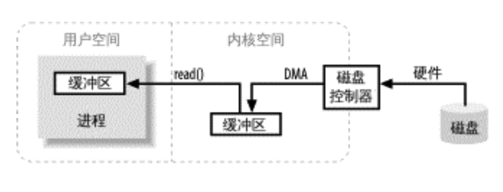

## 简介
从JDK1.4开始，java中提供一个种叫NIO(Non-Blocking IO)的IO处理机制。与以往的标准IO机制(BIO,Blocking IO)不同的是，新的机制把重点放在了如何缩短抽象与现实之间的距离上面。NIO中提出了一种新的抽象，NIO 弥补了原来的BIO的不足，它在标准 Java 代码中提供了高速的、面向块的I/O。

NIO的包括三个核心概念:缓冲区(Buffer)、通道(Channel)、选择器(Selector)。

## BIO与NIO
BIO与NIO之间的共同点是他们都是同步的。而非异步的。
- BIO是阻塞的(当前线程必须等待感兴趣的事情发生), NIO是非柱塞的(事件选择，感兴趣的事情发生可以通知线程，而不必一直在哪等待);
- BIO是面向流式的IO抽象(一次一个字节地处理数据), NIO是面向块的IO抽象(每一个操作都在一步中产生或者消费一个数据块(Buffer));
- BIO的服务器实现模式为一个连接一个线程，NIO服务器实现模式为一个请求一个线程;

## 前提概念

#### 缓冲区操作:
缓冲区，以及缓冲区如何工作，是所有 I/O 的基础。所谓“输入/输出”讲的无非就是把数据移进或移出缓冲区。进程执行 I/O 操作，归结起来，也就是向操作系统发出请求，让它要么把缓冲区里的数据排干 (写)，要么用数据把缓冲区填满(读)。大致流程如图：

